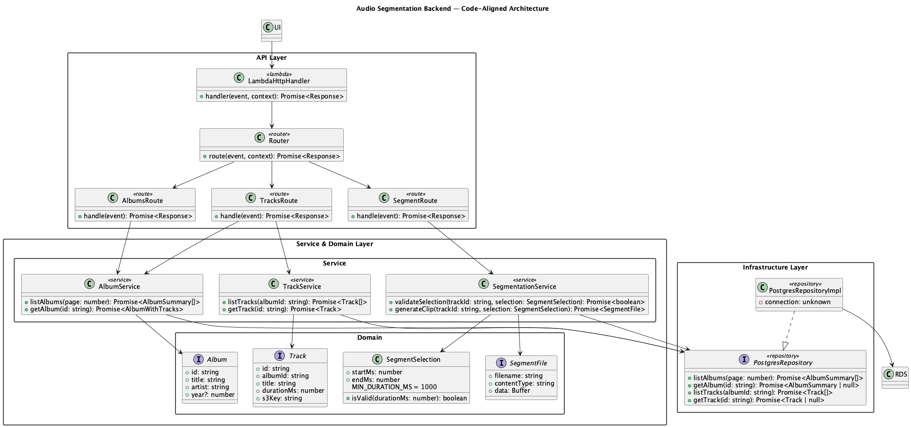
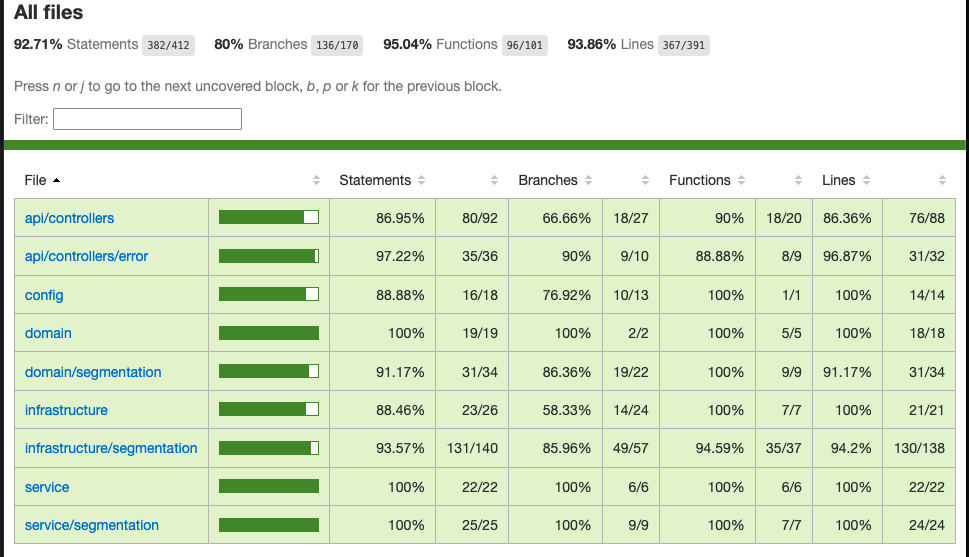

<!-- _class: lead -->
# iPalpiti Audio Segmentation
## Project Overview (v2)
Keita Katsumi · CS5800 F25 (real stakeholder project)
Elena Hernandez
Jay Wageni

Youtube:

Github:

---

## 0. Disclaimer / Expectations
- Real project for **iPalpiti** (international orchestra), not a class project.
- Scope is out of course rubric; partial credit appreciated.
- Teammates not in class; responsibility for alignment is mine.

---

## 1. Mission & Stakeholder
- **Goal**: Digital archive so users browse, preview, and download clipped segments.
- **Value**: Preserve performances, enable monetization via paid clips.
- **Stakeholder**: iPalpiti (international musician association).

---

## 2. Team & Roles
- **Frontend**: Next.js UI (browse, preview, select segment).
- **Backend**: Lambda HTTP API + domain services (my area).
- **Data/Storage**: PostgreSQL on RDS (metadata), S3 (raw audio + trimmed clips).
- Split by module to cut ramp-up time on AWS components.

---

## 3. AWS Architecture (High Level)
```
UI (Next.js) → API Gateway → Lambda → RDS (PostgreSQL)
                               ↕
                              S3
```
- Metadata lives in RDS; media lives in S3 (raw + outputs).
- Serverless keeps ops light; clean separation of metadata vs. media.

---

## 4. Complete Architecture Overview



- API layer: Lambda handler, router, controllers.
- Service layer: Album, Track, Segmentation use cases.
- Infrastructure: Postgres repository via interfaces (swappable).

---

## 5. Layered Backend Intent
- **Controllers**: HTTP I/O, call services.
- **Services**: Album/track listing, preview, segmentation.
- **Infrastructure**: Repos (Postgres impl; swappable for other DBs).
- Goals: separation of concerns, DIP, easy mocking for tests.

---

## 6. TDD Habit
```
┌─────────┐ → ┌──────────┐ → ┌─────────┐ → ┌──────────┐
│  Stubs  │   │ Red bar  │   │ Green   │   │ Refactor │
└─────────┘   └──────────┘   └─────────┘   └──────────┘
```
- Loop: stubs → red → minimal green → refactor.
- Benefits: executable docs, safe refactors, localized failures.
- Strategy refactor targets branch gaps; Jest + coverage HTML to track.

---
## 7. Test Coverage result



___

## 8. Coverage cont 
### Previoue vs Latest Coverage Metrics
- Previouse co: **Statements 91.39% | Branches 76.92% | Functions 91.93% | Lines 92.95%**.
- Latest run: **Statements 92.71% | Branches 80% | Functions 95.04% | Lines 93.86%**.
- Branch coverage is focus for Strategy work.
- Call out branch gaps to set up the Strategy slides that follow.

---


## 8. Strategy (+ Singleton Registry) for Errors
- Problem: growing `if/else` mapping errors → status codes blocked branch coverage.
### Before (If-Chain)
```typescript
const mapErrorToResponse = (error: unknown) => {
  if (error instanceof AlbumNotFoundError || ...) {
    return { status: 404, message: error.message };
  }
  if (error instanceof TrackNotFoundError) {
    return { status: 404, message: error.message };
  }
  // ... more if statements
};
```
- Solution: `ErrorMappingRegistry` with strategies per error class (404, 400, etc.).
- One shared registry; new errors register once.
- Benefits: higher branch coverage, declarative mappings, unit-testable strategies.

---

## 9. Strategy Codebase (backend/src/api/controllers/error/mapping.ts)
- `ErrorMappingRegistry` + registered strategies.
- Show how controllers call the registry and how tests cover each mapping.
- Show how map reference to this.strategy as singleton

---


## 10. Builder + Facade around FFmpeg
- **Builder**: `FFmpegArgsBuilder` assembles args from `TrimRequest` + `AudioConfig`.
- **Facade**: `FFmpegAudioTrimmer.trim()` hides flags, process, timeouts, buffering.
- **Adapters**: `AudioSourceDownloader`, `FFmpegProcessRunner`.
- Benefits: readability, change flags in one place, easy unit tests.

---

## 11. Builder/Facade Codebase (backend/src/infrastructure/segmentation/ffmpegAudioTrimmer.ts)
- `FFmpegArgsBuilder` and `FFmpegAudioTrimmer`.
- Highlight how adapters (`AudioSourceDownloader`, `FFmpegProcessRunner`) plug in.

---


## 16. Conclusion
- Lesson: clean AWS separation, layered backend with DIP, TDD habit, and Design patterns.
- Keytake away: Many things, but TDD and Refactor are Big 2.
- Understaning codebase all the time is the key.

---
