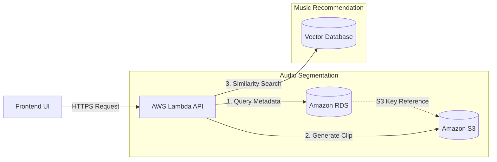

```mermaid
graph LR
    UI[Frontend UI] -->|HTTPS Request| API[AWS Lambda API]
    
    subgraph Segmentation[Audio Segmentation]
      API -->|1. Query Metadata| RDS[(Amazon RDS)]
      RDS -.->|S3 Key Reference| S3[(Amazon S3)]
      API -->|2. Generate Clip| S3
    end
    
    subgraph Recommendation[Music Recommendation]
      API -->|3. Similarity Search| VecDB[(Vector Database)]
    end
```

