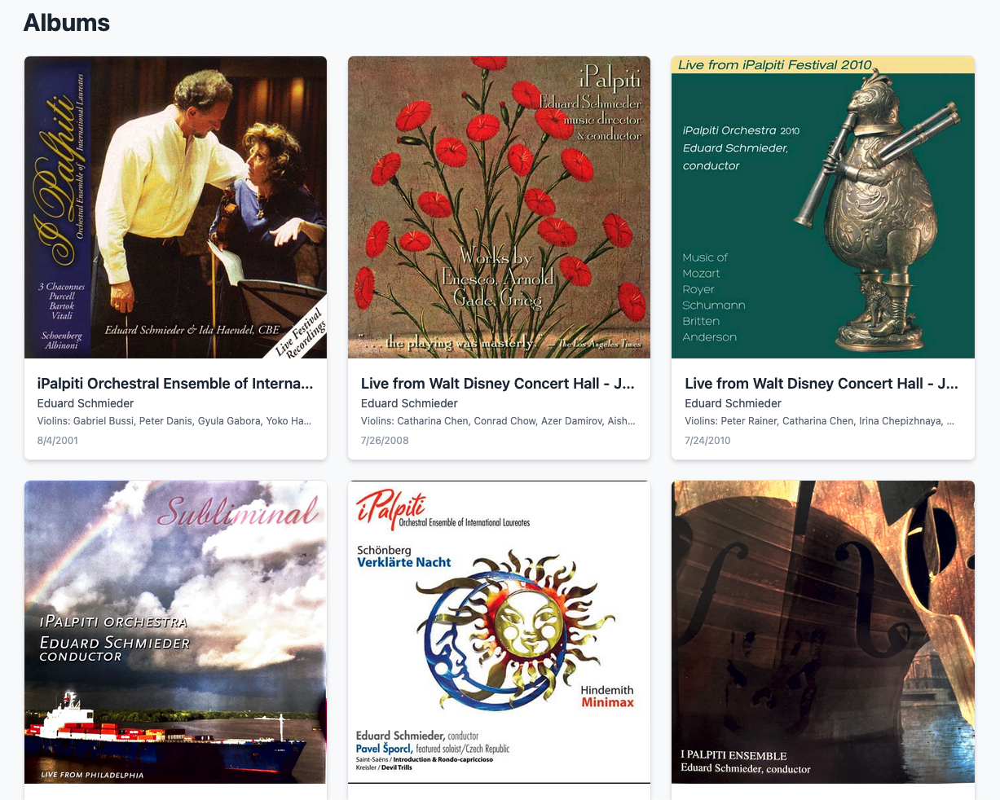
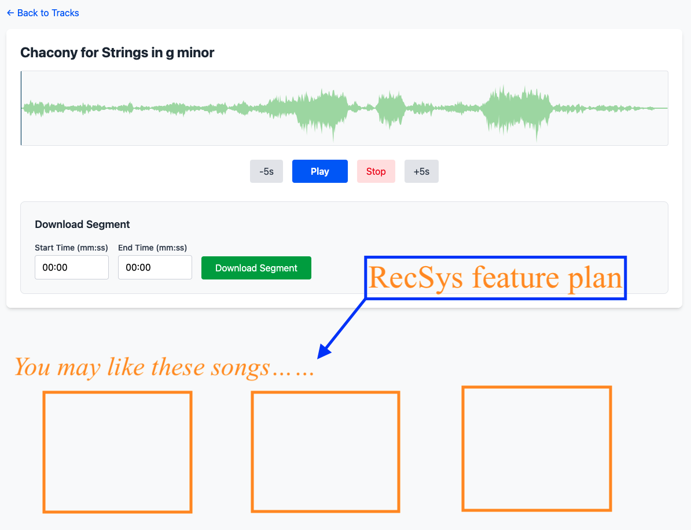
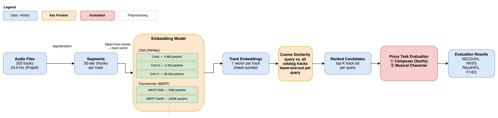
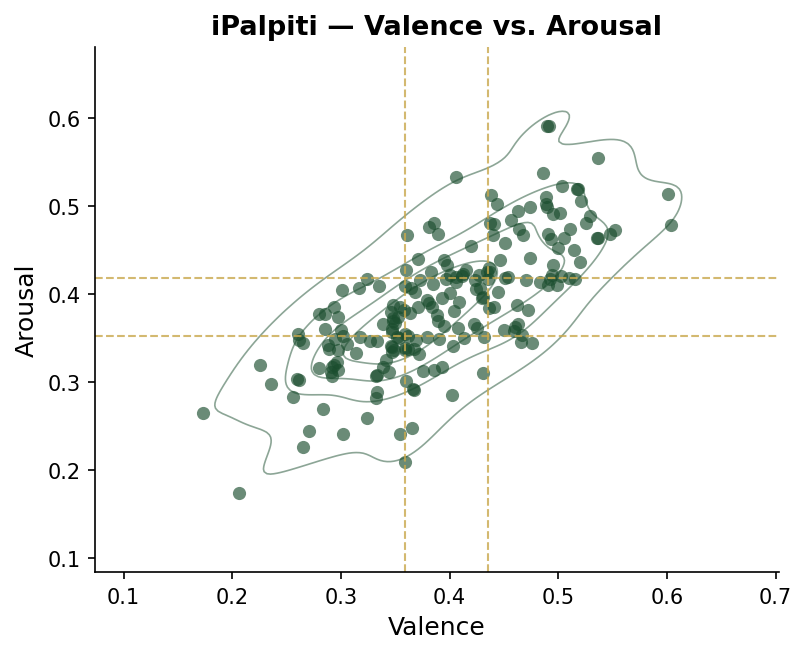

<!-- Slide 1: Title -->

# Does Model Capacity Justify the Cost?

## Evaluating Audio Embeddings for Cold-Start Candidate Generation

**Keita Katsumi**
**CS 6960 — Thesis Defence Presentation**
**4/24/2026**

---

<!-- Agenda -->
# Agenda

1. **Introduction** — motivation, research questions, contributions
2. **Related Work** — embeddings, architectures, evaluation pitfalls
3. **Method** — pipeline, models, proxy tasks, label construction
4. **Results** — ranking quality, extraction cost, ROI analysis
5. **Discussion** — implications, limitations, future work
6. **Conclusion**

---

<!-- Section: Introduction -->
<!-- _backgroundColor: #1a4d2e -->
<!-- _color: #ffffff -->

Section 1

Introduction

Motivation · Research Questions · Contributions

---

<!-- Slide 2: Background Story -->
# Where This Research Comes From

- Our team collaborates with **iPalpiti** — an international classical music archive
- Building a **listening platform on AWS** for users to discover and stream recordings
- Classical music domain — minimal user interaction data

---

<!-- Slide 3: Background Story — The Constraint -->
# The Real-World Constraint

> **Future goal:** add a recommendation panel here — *"You may also like..."*
> But this requires a recommendation system. Where do we start?

---

<!-- Slide 4: Motivation / Problem -->
# The Cold-Start Problem in Music RecSys

- No user history → no collaborative filtering
- Classical music archives: rich audio, minimal usage data
- Candidate generation must rely **entirely** on content

> **Embedding quality = ranking quality. No fallback.**

---

<!-- Slide 6: HOOK -->

"Bigger models = Better ranking?"

 

- Larger models dominate MIR benchmarks
- Natural assumption: scale up → better recommendations
- But does this hold in small, resource-constrained, cold-start settings?

 

> **That's what we set out to find out.**

---

<!-- Slide 7: Research Questions -->
# Research Questions

**RQ1:** Does increasing embedding-model capacity consistently improve candidate ranking quality in a cold-start classical music retrieval setting?

 

**RQ2:** Under what conditions does the computational cost of higher-capacity models justify their deployment for content-based candidate generation?

 

> *Hypothesis: Capacity scaling is non-monotonic and insufficient to justify extraction overhead.*

---

<!-- Slide 8: Introduction — Contributions -->
# Three Contributions

1. **Systematic evaluation** of audio embeddings as a cost–quality trade-off in cold-start candidate generation

2. **Capacity scaling is non-monotonic and task-dependent** — structured vs. abstract retrieval behave differently

3. **Metric mismatch warning** — Recall@K and F1@K can be structurally suppressed when relevant items outnumber K

---

<!-- Section: Related Work -->
<!-- _backgroundColor: #1a4d2e -->
<!-- _color: #ffffff -->

Section 2

Related Work

Embeddings · Architectures · Evaluation Pitfalls

---

<!-- Slide 9: Related Work — Content-Based RecSys -->
# Related Work: Why Embeddings Matter Here

- When interaction data is sparse → collaborative filtering breaks down [Schedl 2018]
- Audio embeddings = primary fallback for cold-start candidate generation [Deldjoo 2024]
- Recent work shows pretrained embeddings are effective **but understudied** within RecSys pipelines [Tamm 2024]

 

- Strong MIR accuracy ≠ well-structured retrieval neighborhoods

---

<!-- Slide 10: Related Work — Architectures -->
# Related Work: CNN vs. Transformer

- **CNN family (PANNs):** strong audio pattern recognition, scales with depth [Kong 2020]
- **Transformer family (AST, MERT):** self-attention on spectrograms, long-range dependencies [Gong 2021; Li 2023]
- Hybrid models exist but are outside scope

 

- Prior work: benchmarks on large, heterogeneous datasets
- **Gap:** small, single-domain archival settings are unexamined

---

<!-- Section: Method -->
<!-- _backgroundColor: #1a4d2e -->
<!-- _color: #ffffff -->

Section 3

Method

Pipeline · Models · Proxy Tasks · Label Construction

---

<!-- Slide 12: Method — Pipeline Overview -->
# Evaluation Pipeline Overview

- No personalization, no collaborative signal, no re-ranking
- Embedding model = the only variable across experiments

---

<!-- Slide 13: Method — Problem Formulation (3.1 in paper) -->
# Formal Problem Setup

- Catalog $D = \{x_1, \ldots, x_N\}$, $N = 203$ tracks
- Embedding model $f_\theta : \mathcal{X} \rightarrow \mathbb{R}^d$ maps each track to a vector
- Ranking by cosine similarity:

$$s(z_q, z_i) = \frac{z_q \cdot z_i}{\|z_q\|\|z_i\|}$$

- Relevance $r_q(x_i) \in \{0,1\}$ defined per proxy task:
  - **Sanity:** $r_q(x_i) = 1$ iff same composer
  - **Character:** $r_q(x_i) = 1$ iff $g_\text{char}(x_q) \cap g_\text{char}(x_i) \neq \emptyset$

---

<!-- Slide 14: Method — Retrieval Pipeline (3.2 in paper) -->
# Retrieval Pipeline

- **Dataset:** 203 tracks, 24.9 hours (iPalpiti classical music archive)
- **Segmentation:** 30-second chunks → mean-pool → single track-level embedding
- **Ranking:** cosine similarity over track-level embeddings
- No personalization, no collaborative signal, no learned re-ranking
- All components held constant — only the embedding model changes

---

<!-- Slide 15: Method — Model Setup (3.3 in paper) -->
# Models Evaluated

| Family | Model | Params | Tier |
|---|---|---|---|
| CNN (PANNs) | Cnn6 | 4.8M | Small |
| CNN (PANNs) | Cnn10 | 5.2M | Medium |
| CNN (PANNs) | Cnn14 | 80.8M | Large |
| Transformer (MERT) | MERT-95M | 95M | Medium |
| Transformer (MERT) | MERT-330M | 330M | Large |

- Within-family comparison = primary analysis
- Cross-family = descriptive only (architecture + pretraining differ)

---

<!-- Slide 16: Method — Proxy Tasks (3.1 in paper) -->
# Two Proxy Retrieval Tasks

- No ground-truth human judgments → use metadata as relevance signal

**Task 1 — Sanity Proxy (Structured)**
- Relevant = same composer
- Clean categorical labels from editorial metadata

 

**Task 2 — Musical Character Proxy (Abstract)**
- Relevant = share ≥1 affective label (Energetic, Calm, Tense, Lyrical)
- Labels generated via Music2Emo [Kang & Herremans, 2025]
- Broader relevance distribution — many items share at least one label
- → Requires pseudo-label construction

---

<!-- Slide 17: Method — Label Construction (3.4 in paper) -->
# How Character Labels Were Built

- **Music2Emo** outputs valence + arousal scores per track
- Mapped to 4 binary tags via the AV framework [Eerola & Vuoskoski, 2011]
- **Labels fixed before evaluation** → no model-dependent bias

| Label | Condition |
|---|---|
| Energetic | Arousal ≥ 67th pct |
| Calm | Arousal ≤ 33rd pct |
| Tense | Valence ≤ 33rd pct |
| Lyrical | VA in 40–60th pct band |

> **Why percentiles?** Classical music clusters in a narrow mid-range VA space — fixed absolute thresholds would yield near-empty label classes.

---

<!-- Slide 18: Method — Evaluation Protocol (3.5 in paper) -->
# Evaluation Protocol

- **Leave-one-out:** each of the 203 tracks serves as a query; excluded from candidate pool
- **Metrics averaged** across all 203 queries
- **Tie-aware ranking** with averaged ranks

 

| Metric | Type | Role |
|---|---|---|
| NDCG@5 | Rank-aware | Primary |
| Hit@5 | Rank-aware | Primary |
| Recall@5 | Set-based | Secondary / caution |
| F1@5 | Set-based | Secondary / caution |

---

<!-- Section: Results -->
<!-- _backgroundColor: #1a4d2e -->
<!-- _color: #ffffff -->

Section 4

Results

Ranking Quality · Extraction Cost · ROI Analysis

---

<!-- Slide 19: Results — Sanity Proxy Table -->
# Results: Composer Retrieval (Structured Task)

| Model | NDCG@5 | Hit@5 | Recall@5 | F1@5 |
|---|---|---|---|---|
| CNN-Small | 0.548 | 0.640 | 0.195 | 0.188 |
| CNN-Medium | 0.545 | 0.640 | 0.215 | 0.214 |
| CNN-Large | 0.585 | 0.660 | 0.228 | 0.229 |
| Transformer-Medium | **0.642** | **0.709** | **0.263** | **0.265** |
| Transformer-Large | 0.588 | 0.665 | 0.233 | 0.224 |

- CNN: NDCG@5 dips Small → Medium, recovers at Large (**non-monotonic**)
- Transformer: Large **underperforms** Medium on all metrics

---

<!-- Slide 20: Results — Composer Retrieval Deep Dive -->
# Surprise: The Larger Transformer Is Worse

- Transformer-Medium: NDCG@5 = **0.642**, Hit@5 = **0.709**
- Transformer-Large: NDCG@5 = **0.588**, Hit@5 = **0.665**

 

- More parameters → worse structured ranking
- CNN-Large reaches 0.585 — comparable to Transformer-Large
- At **17× fewer parameters**

 

> *Within-family capacity scaling is non-monotonic.*

---

<!-- Slide 21: Results — Musical Character Proxy Table -->
# Results: Character Retrieval (Abstract Task)

| Model | NDCG@5 | Hit@5 | Recall@5 | F1@5 |
|---|---|---|---|---|
| CNN-Small | **0.653** | **0.783** | 0.039 | 0.071 |
| CNN-Medium | 0.656 | 0.768 | 0.038 | 0.070 |
| CNN-Large | 0.642 | 0.749 | 0.038 | 0.070 |
| Transformer-Medium | 0.632 | 0.778 | 0.033 | 0.060 |
| Transformer-Large | 0.631 | 0.764 | 0.036 | 0.066 |

- NDCG@5 spread across all models: **< 0.025** — negligible
- Hit@5 is high (≥ 0.749), yet Recall@5 is uniformly low (≤ 0.039)

---

<!-- Slide 22: Results — Metric Mismatch Explanation -->
# Why Is Recall@5 So Low? (Metric Mismatch)

- Character proxy: many items share ≥1 label → **large relevant set per query**
- At K=5, Recall@5 can only capture a tiny fraction of relevant items — structurally suppressed
- Hit@5 ≥ 0.749 — models **are** ranking relevant items near the top

 

- → Recall@5 / F1@5 give a **false negative** picture here
- → NDCG@5 and Hit@5 are the reliable signals in this regime

---

<!-- Slide 23: Results — Extraction Cost -->
# The Cost Side of the Trade-Off

| Model | Params (M) | Emb Dim | Latency (ms/track) |
|---|---|---|---|
| CNN-Small | 4.8 | 512 | **2,179** |
| CNN-Medium | 5.2 | 512 | 3,109 |
| CNN-Large | 80.8 | 2,048 | 4,218 |
| Transformer-Medium | 95 | 768 | 23,146 |
| Transformer-Large | 330 | 1,024 | **55,724** |

- Transformer-Large = **~25× slower** than CNN-Small
- **No ranking improvement** on either task
- Cost paid at every catalog re-ingestion

---

<!-- Slide 24: Results — Cost vs. Quality -->
# ROI Collapses at High Capacity

| Model | Latency (ms) | NDCG@5 Composer | NDCG@5 Char |
|---|---|---|---|
| CNN-Small | 2,179 | 0.548 | 0.653 |
| CNN-Medium | 3,109 | 0.545 | 0.656 |
| CNN-Large | 4,218 | 0.585 | 0.642 |
| Transformer-M | 23,146 | **0.642** | 0.632 |
| Transformer-L | 55,724 | 0.588 | 0.631 |

- Transformer-Large: **25× the cost**, worse ranking
- CNN-Small: lowest cost, competitive quality

---

<!-- Section: Discussion -->
<!-- _backgroundColor: #1a4d2e -->
<!-- _color: #ffffff -->

Section 5

Discussion

Implications · Limitations · Future Work

---

<!-- Slide 25: Discussion — Main Finding -->
# Discussion: What This Means

- Capacity scaling is **non-monotonic** in both families
- Task structure matters more than model size for metric behavior
- The largest model never achieves the best ranking quality

 

- Consistent with Tamm 2024: MIR benchmark accuracy ≠ retrieval quality in RecSys
- Stylistic homogeneity of the archive may compress embedding space → less room for capacity to help

---

<!-- Slide 26: Discussion — System Implications -->
# System-Level Implications

- In cold-start settings, the embedding model **is** the ranking system
- No collaborative signal to compensate for poor candidates
- Model selection = a **direct operational decision**

 

- **Mid-sized models offer the best cost–quality profile**
- CNN-Small / CNN-Medium: within 0.04 NDCG of Transformer-Medium at ~10× lower latency
- Critical for systems without GPU infrastructure or with frequent catalog updates

---

<!-- Slide 27: Limitations -->
# Limitations

1. **Small dataset (N=203):** intentional — a controlled stress test; if scaling fails here, it likely fails in larger archives too
2. **No user modeling:** candidate generation stage isolated; downstream re-ranking not evaluated
3. **Pseudo-labels for character task:** generated by pretrained model (Music2Emo); may carry systemic bias — but fixed across all embeddings, so relative comparisons hold
4. **Mean-pooling:** may dilute fine-grained temporal information in long-form recordings

---

<!-- Slide 28: Future Work -->
# Future Work

- **Scale up:** test in larger, heterogeneous catalogs — does the non-monotonic pattern persist?
- **Richer labels:** expert annotations or listener-derived similarity to improve abstract task sensitivity
- **Sequence-aware aggregation:** beyond mean-pooling for long-form classical audio
- **End-to-end evaluation:** connect candidate generation to downstream re-ranking — do these NDCG differences matter at the system level?

---

<!-- Section: Conclusion -->
<!-- _backgroundColor: #1a4d2e -->
<!-- _color: #ffffff -->

Section 6

Conclusion

Key Takeaways

---

<!-- Slide 29: Conclusion -->
# Conclusion

- Evaluated 5 pretrained audio models across 2 families and 3+ capacity tiers
- **Capacity scaling is non-monotonic and task-dependent**
- No model achieves consistently best ranking across both tasks
- Transformer-Large: **25× extraction overhead, no ranking gain**

 

> In small, cold-start settings, increasing model capacity does not reliably improve ranking quality — but significantly increases cost.
> **Model selection is a cost–quality trade-off, not a pure performance optimization problem.**

---

<!-- Slide 30: References -->
# References

- Schedl et al. (2018). Current challenges and visions in music recommender systems. *IJMIR*.
- Deldjoo et al. (2024). Content-driven music recommendation: Evolution, state of the art. *Computer Science Review*.
- Tamm & Aljanaki (2024). Comparative analysis of pretrained audio representations in music recommender systems. *RecSys '24*.
- Kong et al. (2020). PANNs: Large-scale pretrained audio neural networks. *IEEE/ACM TASLP*.
- Li et al. (2023). MERT: Acoustic Music Understanding Model with large-scale self-supervised training. *arXiv*.
- Gong et al. (2021). AST: Audio Spectrogram Transformer. *arXiv*.
- Zaman et al. (2023). A survey of audio classification using deep learning. *IEEE Access*.
- Canamares & Castells (2020). On target item sampling in offline recommender system evaluation. *RecSys '20*.
- Urbano, Schedl & Serra (2013). Evaluation in music information retrieval. *JIIS*.
- Eerola & Vuoskoski (2011). Discrete and dimensional models of emotion in music. *Psychology of Music*.
- Kang & Herremans (2025). Towards unified music emotion recognition. *arXiv*.

---

<!-- Slide 31: Q&A / Thank You -->
# Thank You

**Keita Katsumi**
**CS 6960 — Thesis Defence**
**4/24/2026**

