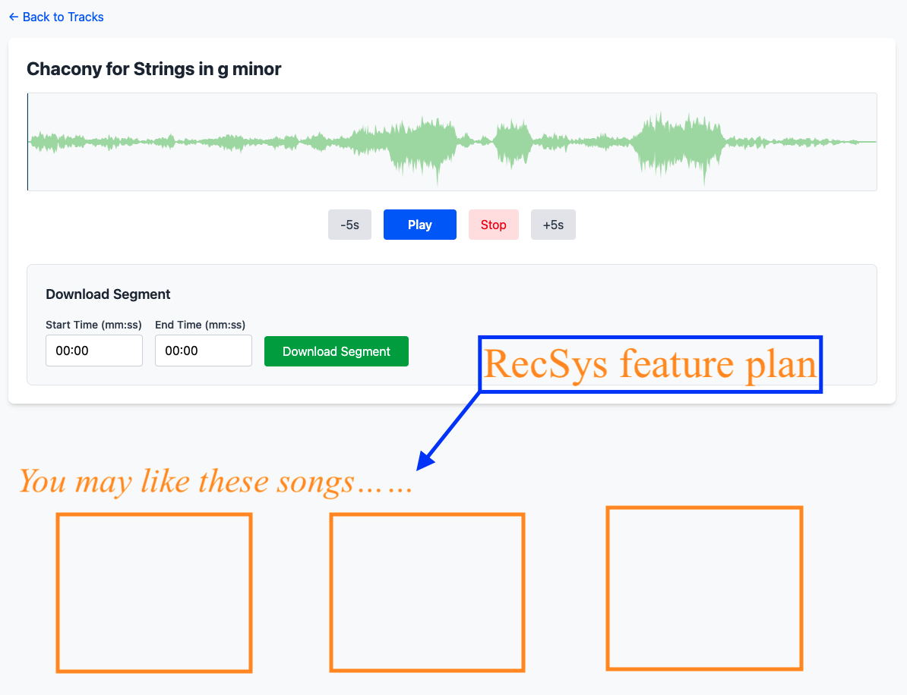
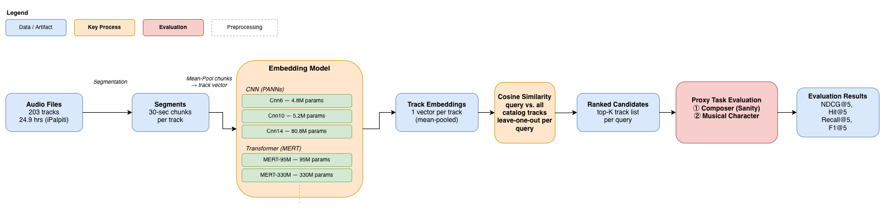
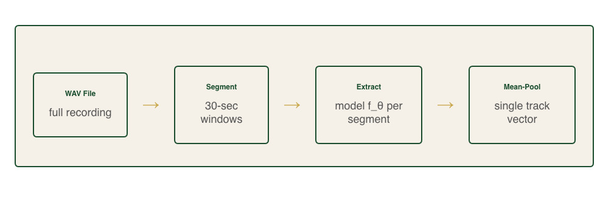
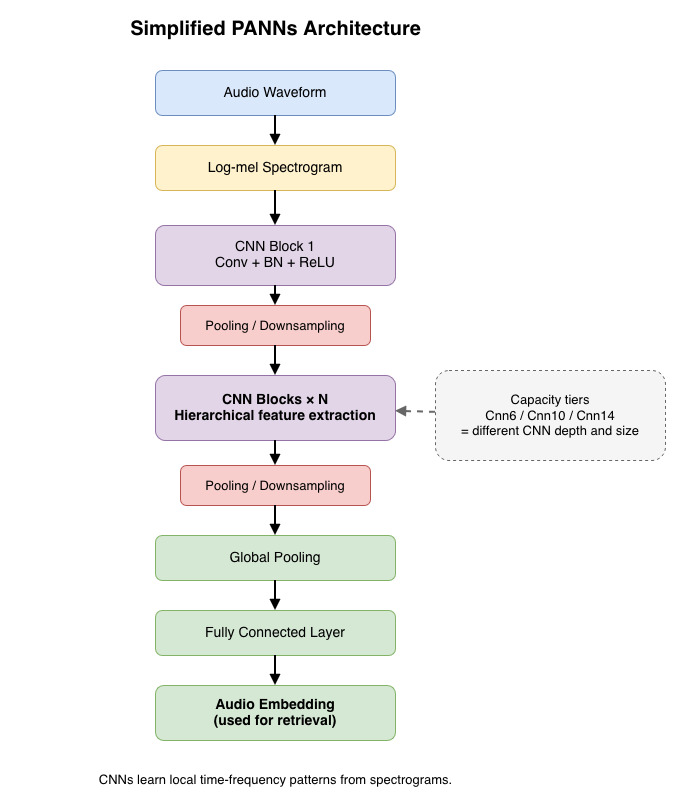
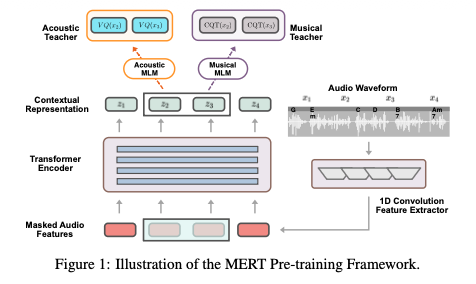
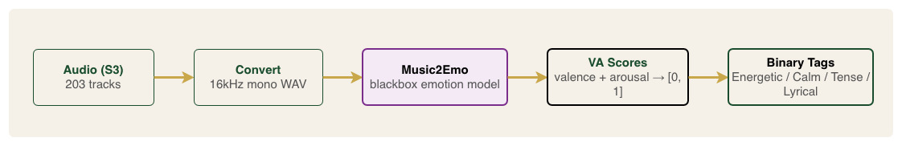
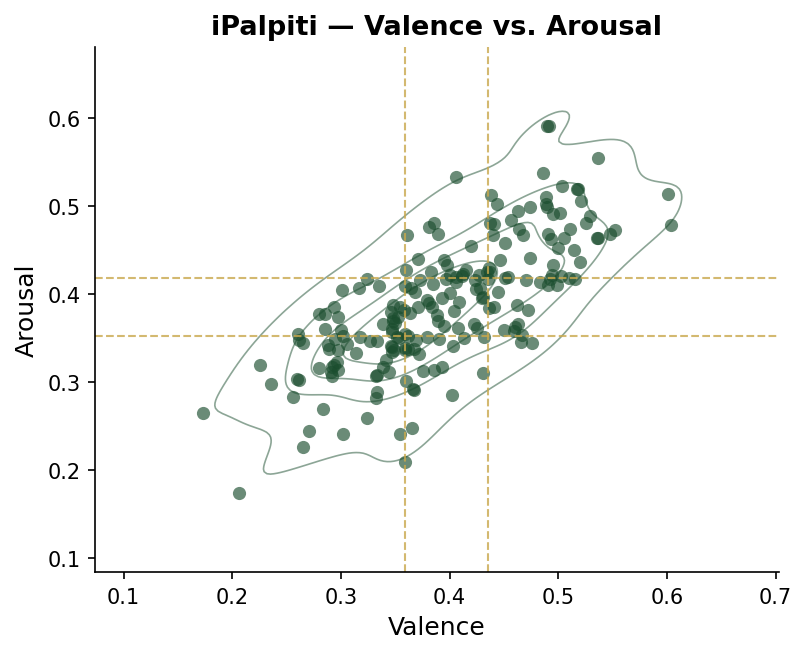
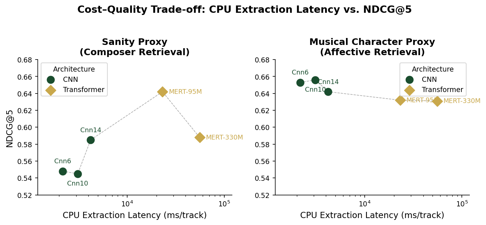

<!-- Slide 1: Title -->

# Does Model Capacity Justify the Cost?

## Evaluating Audio Embeddings for Cold-Start Candidate Generation

**Keita Katsumi**
**CS 6960 — Thesis Defence Presentation**
**5/1/2026**

---

<!-- Agenda -->
# Agenda

1. **Introduction** — motivation, research questions, contributions
2. **Related Work** — embeddings, architectures, evaluation pitfalls
3. **Methodology** — pipeline, models, proxy tasks, label construction
4. **Results** — ranking quality, extraction cost, ROI analysis
5. **Discussion** — implications, limitations
6. **Conclusion** — key takeaways
7. **Future Work**

---

<!-- Section: Introduction -->
<!-- _backgroundColor: #1a4d2e -->
<!-- _color: #ffffff -->

Section 1

Introduction

Motivation · Research Questions · Contributions

---

<!-- Slide 2: Background Story -->
# Where This Research Comes From

- Our team collaborates with **iPalpiti**, an international classical music archive
- Building a **listening platform on AWS** for users to discover and stream recordings
- Classical music domain with minimal user interaction data

---

<!-- Slide 3: Background Story — The Constraint -->
# The Real-World Constraint

- Users finish a piece — what plays next?
- A good RecSys delivers **serendipity**: songs they have never heard but will likely love
- Neuroscience: the brain's reward response peaks at the *familiar-yet-novel* sweet spot — not random, not repetitive

> **Future goal:** add a recommendation panel in the playback section

---

<!-- Slide 4: Motivation / Problem -->
# The Cold-Start Problem in Music RecSys

- That sweet spot depends on **musical similarity** — which the system must compute
- No user history → no collaborative filtering
- Classical music archives: rich audio, minimal usage data
- Candidate generation must rely **entirely** on content

> **Embedding quality = ranking quality. No fallback.**

---

<!-- Slide 6: HOOK -->

"Bigger models = Better ranking?"

 

- Larger models dominate MIR benchmarks
- Natural assumption: scale up → better recommendations
- But does this hold in small, resource-constrained, cold-start settings?

 

> **That's what we set out to find out.**

---

<!-- Slide 7: Research Questions -->
# Research Questions

**RQ1:** How does audio encoder capacity affect offline retrieval quality under strict cold-start conditions — across within-family scaling, categorical vs. semantic tasks, and CNN vs. Transformer families?

 

**RQ2:** How does metric choice — position-sensitive (NDCG@K) vs. position-insensitive (Recall@K, F1@K, Hit@K) — affect capacity-scaling conclusions when relevant items outnumber K?

 

**RQ3:** At what encoder capacity does marginal ranking improvement fall below marginal extraction cost?

 

> *Hypothesis: Capacity scaling is non-monotonic and the extraction overhead is not justified.*

---

<!-- Slide 8: Introduction — Contributions -->
# Four Contributions

1. **Cold-start scaling study:** first systematic evaluation of audio encoder capacity for candidate generation where embedding quality alone determines ranking

2. **Non-monotonic, task-dependent scaling:** structured vs. abstract retrieval respond differently; largest model never wins

3. **Metric mismatch characterization:** Recall@K / F1@K bounded by K/|R| when |R| is large; NDCG@K recovers genuine differences

4. **Cost–quality trade-off for deployment:** latency scales near-linearly with parameters; mid-capacity encoders Pareto-dominate larger variants

---

<!-- Section: Related Work -->
<!-- _backgroundColor: #1a4d2e -->
<!-- _color: #ffffff -->

Section 2

Related Work

Embeddings · Architectures · Evaluation Pitfalls

---

<!-- Slide 8b: Related Work — RecSys Approaches -->
# Three Approaches to Music Recommendation

Collaborative Filtering

- Uses **user–item interaction** history (plays, likes, skips)
- "Users like you also liked…"
- Fails with **no interaction data** (cold-start)

Content-Based — Our Approach

- Uses **audio signal itself** — no user history needed
- Embed audio → retrieve similar tracks by embedding distance
- Works under **strict cold-start** (new catalogue, no listeners)

Context-Based

- Uses **situational signals** (time, location, mood input)
- "Music for studying at night…"
- Requires external context — unavailable in cold-start

→ Cold-start constraint forces content-based: the audio embedding is the only available signal.

---

<!-- Slide 9: Related Work — Content-Based RecSys -->
# Related Work: Why Embeddings Matter Here

- When interaction data is sparse → collaborative filtering breaks down [1]
- Audio embeddings = primary fallback for cold-start candidate generation [2]
- Recent work shows pretrained embeddings are effective **but understudied** within RecSys pipelines [3]

 

- Strong MIR accuracy ≠ well-structured retrieval neighborhoods

---

<!-- Slide 10: Related Work — Architectures -->
# Related Work: CNN vs. Transformer

- **CNN family (PANNs)** [4]: pretrained on AudioSet; Cnn6/10/14 scale via depth (6→14 layers); 4.8M–80.8M params = **17× spread** within one training regime
- **Transformer family (MERT)** [5]: self-supervised on 160K hours of music; MERT-95M and MERT-330M = 3.5× increase; **no small checkpoint available**
- **AST** [6]: attention directly on spectrogram patches, no CNN inductive bias; quadratic attention cost with patch count
- Hybrid models exist but are outside scope

 

- Prior scaling studies [7]: classification accuracy on AudioSet / ESC-50, **not retrieval in a constrained domain**
- **Gap:** translating those conclusions to archival candidate generation is unreliable

---

<!-- Section: Methodology -->
<!-- _backgroundColor: #1a4d2e -->
<!-- _color: #ffffff -->

Section 3

Methodology

Pipeline · Models · Proxy Tasks · Label Construction

---

<!-- Slide 12: Methodology — Pipeline Overview -->
# Evaluation Pipeline Overview

- **Dataset:** 203 tracks, 24.9 hours (iPalpiti classical music archive)
- **Preprocessing:** 30-sec segmentation + mean-pooling (next slide)
- **Ranking:** cosine similarity with no personalization, no collaborative signal, no re-ranking
- Only the embedding model changes across experiments

---

<!-- Slide 12b: Methodology — Audio Preprocessing -->
# Audio Preprocessing: Track-Level Embedding

- 30-second window is standard in MIR; keeps input length uniform across all five models
- Mean-pooling is model-agnostic — the same aggregation is applied to every model, keeping comparisons fair
- Trade-off: temporal structure within a recording is not preserved (addressed in Limitations)

---

<!-- Slide 13: Methodology — Problem Formulation (3.1 in paper) -->
# Formal Problem Setup

- Catalog $D = \{x_1, \ldots, x_N\}$, $N = 203$ tracks
- Embedding model $f_\theta : \mathcal{X} \rightarrow \mathbb{R}^d$ maps each track to a vector
- Ranking by cosine similarity:

$$s(z_q, z_i) = \frac{z_q \cdot z_i}{\|z_q\|\|z_i\|}$$

- Relevance $r_q(x_i) \in \{0,1\}$ defined per proxy task:
  - **Sanity:** $r_q(x_i) = 1$ iff same composer
  - **Character:** $r_q(x_i) = 1$ iff $g_\text{char}(x_q) \cap g_\text{char}(x_i) \neq \emptyset$

---

<!-- Slide 15: Methodology — Model Setup (3.3 in paper) -->
# Models Evaluated

| Family | Model | Params | Tier |
|---|---|---|---|
| CNN (PANNs) | Cnn6 | 4.8M | Small |
| CNN (PANNs) | Cnn10 | 5.2M | Medium |
| CNN (PANNs) | Cnn14 | 80.8M | Large |
| Transformer (MERT) | MERT-95M | 95M | Medium |
| Transformer (MERT) | MERT-330M | 330M | Large |

- Within-family comparison = primary analysis
- Cross-family = descriptive only (architecture + pretraining differ)

---

<!-- Slide 15a: Methodology — PANNs Architecture -->
# CNN Family: PANNs Architecture

**Full PANNs (paper)**

**What we use**

- Pretrained on **AudioSet** (527-class audio classification)
- Paper uses **dual inputs**: raw waveform + log-mel spectrogram (concatenated)
- We use the **log-mel only** path → CNN blocks → global pooling → embedding
- Capacity scales via **depth**: Cnn6 → Cnn10 → Cnn14 (4.8M to 80.8M params)
- Strong local pattern detector; inductive bias toward spectral features

---

<!-- Slide 15b: Methodology — MERT Architecture -->
# Transformer Family: MERT Architecture

- Self-supervised pretraining on **160K hours of music** (no labels)
- Uses **masked audio modeling**: predicts masked tokens via acoustic + musical teachers
- 1D convolution feature extractor feeds a **Transformer encoder** (attention over full sequence)

---

<!-- Slide 16: Methodology — Proxy Tasks (3.1 in paper) -->
# Two Proxy Retrieval Tasks

- No ground-truth human judgments → use metadata as relevance signal

**Task 1: Sanity Proxy (Structured)**
- Relevant = same composer
- Clean categorical labels from editorial metadata

 

**Task 2: Musical Character Proxy (Abstract)**
- Relevant = share ≥1 affective label (Energetic, Calm, Tense, Lyrical)
- Labels generated via Music2Emo [11]
- Broader relevance distribution; many items share at least one label
- → Requires pseudo-label construction

---

<!-- Slide 16b: Methodology — Pseudo-Label Pipeline -->
# How Pseudo-Labels Are Generated

- **Music2Emo** computes **valence + arousal scores** per track → mapped to emotion tags via percentile thresholds; emotion and musicality overlap, so these tags serve as proxies for musical character
- VA scores normalized to [0, 1]; tags assigned by **dataset-relative percentile thresholds**
- **Labels fixed before any embedding model runs** → no model-dependent bias

---

<!-- Slide 17: Methodology — Label Construction (3.4 in paper) -->
# How Character Labels Were Built

- **Music2Emo** outputs valence + arousal scores per track
- Mapped to 4 binary tags via the AV framework [10]
- **Labels fixed before evaluation** → no model-dependent bias

| Label | Condition |
|---|---|
| Energetic | Arousal ≥ 67th pct |
| Calm | Arousal ≤ 33rd pct |
| Tense | Valence ≤ 33rd pct |
| Lyrical | VA in 40–60th pct band |

> **Why percentiles?** Classical music clusters in a narrow mid-range VA space — fixed absolute thresholds would yield near-empty label classes.

---

<!-- Slide 18: Methodology — Evaluation Protocol (3.5 in paper) -->
# Evaluation Protocol

- **Leave-one-out:** each of the 203 tracks serves as a query; excluded from candidate pool
- **Metrics averaged** across all 203 queries
- **Tie-aware ranking** with averaged ranks

 

| Metric | Type | Role |
|---|---|---|
| NDCG@5 | Rank-aware | Primary |
| Hit@5 | Rank-aware | Primary |
| Recall@5 | Set-based | Secondary / caution |
| F1@5 | Set-based | Secondary / caution |

---

<!-- Section: Results -->
<!-- _backgroundColor: #1a4d2e -->
<!-- _color: #ffffff -->

Section 4

Results

Ranking Quality · Extraction Cost · ROI Analysis

---

<!-- Slide 18b: Results — Baseline Definition -->
# Reading the Results: Baseline

- **CNN-Small (Cnn6, 4.8M params)** is our baseline
- Smallest model, lowest extraction cost → the floor every other model must beat to justify its added cost
- All comparisons ask: **does more capacity or a different architecture earn its keep?**

| | CNN-Small | CNN-Medium | CNN-Large | Transformer-Med | Transformer-Large |
|---|---|---|---|---|---|
| Params | 4.8M | 5.2M | 80.8M | 86M | 330M |
| Role | **Baseline** | +capacity | +capacity | cross-family | cross-family |

---

<!-- Slide 19: Results — Sanity Proxy Table -->
# Results: Composer Retrieval (Structured Task)

| Model | NDCG@5 | Hit@5 | Recall@5 | F1@5 |
|---|---|---|---|---|
| CNN-Small | 0.548 | 0.640 | 0.195 | 0.188 |
| CNN-Medium | 0.545 | 0.640 | 0.215 | 0.214 |
| CNN-Large | 0.585 | 0.660 | 0.228 | 0.229 |
| Transformer-Medium | **0.642** | **0.709** | **0.263** | **0.265** |
| Transformer-Large | 0.588 | 0.665 | 0.233 | 0.224 |

- CNN: NDCG@5 dips Small → Medium, recovers at Large (**non-monotonic**)
- Transformer-Large **underperforms** Medium: more parameters → worse structured ranking
- CNN-Small (4.8M) is only 0.04 NDCG behind Transformer-Large (330M) at **~70× fewer parameters**

---

<!-- Slide 21: Results — Musical Character Proxy Table -->
# Results: Character Retrieval (Abstract Task)

| Model | NDCG@5 | Hit@5 | Recall@5 | F1@5 |
|---|---|---|---|---|
| CNN-Small | **0.653** | **0.783** | 0.039 | 0.071 |
| CNN-Medium | 0.656 | 0.768 | 0.038 | 0.070 |
| CNN-Large | 0.642 | 0.749 | 0.038 | 0.070 |
| Transformer-Medium | 0.632 | 0.778 | 0.033 | 0.060 |
| Transformer-Large | 0.631 | 0.764 | 0.036 | 0.066 |

- NDCG@5 spread across all models: **< 0.025** (negligible)
- Hit@5 is high (≥ 0.749), yet Recall@5 is uniformly low (≤ 0.039)

---

<!-- Slide 22: Results — Metric Mismatch Explanation -->
# Why Is Recall@5 So Low? (Metric Mismatch)

- Character proxy: many items share ≥1 label → **large relevant set per query**
- At K=5, Recall@5 can only capture a tiny fraction of relevant items; it is structurally suppressed
- Hit@5 ≥ 0.749: models **are** ranking relevant items near the top

 

- → Recall@5 / F1@5 give a **false negative** picture here [8]
- → NDCG@5 and Hit@5 are the reliable signals in this regime [9]

---

<!-- Slide 24: Results — Cost vs. Quality -->
# ROI Collapses at High Capacity

| Model | Latency (ms) | NDCG@5 Composer | NDCG@5 Char |
|---|---|---|---|
| CNN-Small | 2,179 | 0.548 | 0.653 |
| CNN-Medium | 3,109 | 0.545 | 0.656 |
| CNN-Large | 4,218 | 0.585 | 0.642 |
| Transformer-M | 23,146 | **0.642** | 0.632 |
| Transformer-L | 55,724 | 0.588 | 0.631 |

- Transformer-Large: **25× the cost**, worse ranking
- CNN-Small: lowest cost, competitive quality

---

<!-- Section: Discussion -->
<!-- _backgroundColor: #1a4d2e -->
<!-- _color: #ffffff -->

Section 5

Discussion

Implications · Limitations

---

<!-- Slide 25: Discussion — RQ Answers & Hypothesis -->
# Research Questions: Answered

**RQ1: Does capacity consistently improve ranking?**
→ No. Scaling is non-monotonic and depends on the task.

**RQ2: Does metric choice change the conclusion?**
→ Yes. NDCG avoids this by rewarding rank position, not just count.

**RQ3: When does added cost stop being worth it?**
→ In proxy task 1 at Transformer-Medium. Beyond that, cost jumps up to 25× with no ranking gain, while proxy task 2 is about the same metrics result.

 

> **Hypothesis supported:** bigger is not better — and the overhead is not justified.

---

<!-- Slide 26: Discussion — System Implications -->
# System-Level Implications

- In cold-start settings, the embedding model **is** the ranking system
- No collaborative signal to compensate for poor candidates
- Model selection = a **direct operational decision**

 

- **Mid-sized models offer the best cost–quality profile**
- CNN-Small / CNN-Medium: within 0.04 NDCG of Transformer-Medium at ~10× lower latency
- Critical for systems without GPU infrastructure or with frequent catalog updates

---

<!-- Slide 27: Limitations -->
# Limitations

1. **Small dataset (N=203):** intentional controlled stress test; if scaling fails here, it likely fails in larger archives too
2. **No user modeling:** candidate generation stage isolated; downstream re-ranking not evaluated
3. **Pseudo-labels for character task:** generated by pretrained model (Music2Emo); may carry systemic bias, but fixed across all embeddings so relative comparisons hold
4. **Mean-pooling:** may dilute fine-grained temporal information in long-form recordings

---

<!-- Section: Conclusion -->
<!-- _backgroundColor: #1a4d2e -->
<!-- _color: #ffffff -->

Section 6

Conclusion

Key Takeaways

---

<!-- Slide 29: Conclusion -->
# Conclusion

- Evaluated 5 pretrained audio models across 2 families and 3+ capacity tiers
- **Capacity scaling is non-monotonic and task-dependent**
- No model achieves consistently best ranking across both tasks
- Transformer-Large: **25× extraction overhead, no ranking gain**
- This work has been submitted to **ACM RecSys 2026**

 

> In small, cold-start settings, increasing model capacity does not reliably improve ranking quality — but significantly increases cost.
> **Model selection is a cost–quality trade-off, not a pure performance optimization problem.**

---

<!-- Section: Future Work -->
<!-- _backgroundColor: #1a4d2e -->
<!-- _color: #ffffff -->

Section 7

Future Work

---

<!-- Slide 30: Future Work -->
# Future Work

- **Scale up:** test in larger, heterogeneous catalogs to see if the non-monotonic pattern persists
- **Richer labels:** expert annotations or listener-derived similarity to improve abstract task sensitivity
- **Sequence-aware aggregation:** beyond mean-pooling for long-form classical audio
- **End-to-end evaluation:** connect candidate generation to downstream re-ranking to assess whether these NDCG differences matter at the system level

---

<!-- Slide 31: References -->
# References

- [1] Schedl et al. (2018). Current challenges and visions in music recommender systems. *IJMIR*.
- [2] Deldjoo et al. (2024). Content-driven music recommendation: Evolution, state of the art. *Computer Science Review*.
- [3] Tamm & Aljanaki (2024). Comparative analysis of pretrained audio representations in music recommender systems. *RecSys '24*.
- [4] Kong et al. (2020). PANNs: Large-scale pretrained audio neural networks. *IEEE/ACM TASLP*.
- [5] Li et al. (2023). MERT: Acoustic Music Understanding Model with large-scale self-supervised training. *arXiv*.
- [6] Gong et al. (2021). AST: Audio Spectrogram Transformer. *arXiv*.
- [7] Zaman et al. (2023). A survey of audio classification using deep learning. *IEEE Access*.
- [8] Canamares & Castells (2020). On target item sampling in offline recommender system evaluation. *RecSys '20*.
- [9] Urbano, Schedl & Serra (2013). Evaluation in music information retrieval. *JIIS*.
- [10] Eerola & Vuoskoski (2011). Discrete and dimensional models of emotion in music. *Psychology of Music*.
- [11] Kang & Herremans (2025). Towards unified music emotion recognition. *arXiv*.

---

<!-- Slide 33: Q&A -->
<!-- _backgroundColor: #1a4d2e -->
<!-- _color: #ffffff -->

Q&A

Keita Katsumi · CS 6960 Thesis Defence · 5/1/2026

